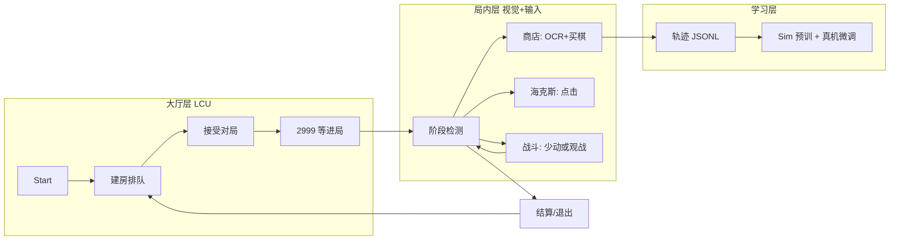

# Architecture

## Layer Diagram

```
┌─────────────────────────────────────────────┐
│              Python (RL layer)              │
│  train_ppo.py ←→ env_client.py ←→ SB3 PPO  │
└──────────────────┬──────────────────────────┘
                   │ JSON Lines (stdin/stdout)
┌──────────────────┴──────────────────────────┐
│              agent-cli (Rust binary)        │
│  arg parse → SimEnv::reset/step → JSON out  │
└──────────────────┬──────────────────────────┘
                   │
┌──────────────────┴──────────────────────────┐
│              tft-env (Rust crate)           │
│  TftEnv trait  │  SimEnv  │  RealEnv (M3+)  │
│  DiscreteAction│  Obs     │  StepResult     │
└────────┬───────┴────┬─────┴─────────────────┘
         │            │
┌────────┴───┐  ┌─────┴──────┐
│ tft-sim    │  │ tft-domain │
│ simulator  │  │ types, MDP │
│ episode    │  │ aliases    │
└────────────┘  └────────────┘
```

## End-to-end product flow (大厅挂机 → 局内买棋 → 真机 RL)

Target product (aligned with [TFT-Hextech-Helper](../参考/TFT-Hextech-Helper-main) meta loop + this repo’s executor / `RealEnv` / RL):

- **Meta layer (LCU)**: lobby, queue, accept ready check, wait until in-game API is live.
- **In-game layer (vision + input)**: phase detection, shop OCR + buy with `effect_verified`, augment clicks, minimal action during combat.
- **Learning layer**: JSONL trajectories from verified shop steps; Sim-pretrained PPO / ONNX fine-tuned on real runs.



### Node → implementation map

| Flow node | Reference (Helper) | tft-bot (current / planned) |
|-----------|-------------------|-----------------------------|
| Start | `StartState` — backup/apply `game.cfg`, detect already in game | Planned: meta FSM in `agent-cli` (not yet); optional `GameConfigHelper` port |
| Lobby | `LobbyState` — `createLobbyByQueueId`, `startMatch` | Planned: LCU REST via extend `lcu_gate` / new `tft-meta`; see [LCU_CN.md](LCU_CN.md) |
| Accept | `LobbyState` — WS `READY_CHECK` → `acceptMatch` | Planned: same; fallback poll ready-check if no WS |
| Load | `GameLoadingState` — poll `127.0.0.1:2999` `/liveclientdata/allgamedata` | Planned: in-game API probe; then `win_window` + `tftOperator.init` equivalent |
| Phase | `GameStageMonitor` + LCU `gameflow-phase` | Partial: [phase.rs](../crates/tft-executor/src/phase.rs), `run-match` wait loop |
| Shop | `StrategyService` + OCR/templates | Partial: [shop.rs](../crates/tft-executor/src/shop.rs), `executor-probe read-shop` / `buy` |
| Aug | `handleAugment` — layout clicks 2-1/3-2/4-2 | Planned: [layouts.cn.yaml](../configs/layouts.cn.yaml) + phase=AUGMENT |
| Combat | mostly observe / refresh state | Default: noop or refresh-only; avoid spam clicks (redline) |
| Traj | — | [run-bot / run-match](../apps/agent-cli) `--trajectory` JSONL |
| Train | — | M0/M1 Sim PPO; M3+ real trajectories → [train_ppo.py](../python/tft_bot_rl/train_ppo.py) / fine-tune |
| End | `quitGame` / battle-pass event → lobby | Planned: LCU `early-exit` or phase `WaitingForStats`; loop to Lobby |

**Meta**：国服默认 `TFT_META_MODE=manual`，用户进局后从 2999/窗口开始；见 [LCU_CN.md](LCU_CN.md)。

Milestone tracking for meta FSM vs in-game acceptance: [COMPLETION.md](COMPLETION.md).

## Data Flow

1. Python calls `env.reset(seed)` → spawns `agent-cli sim-env --seed N`
2. agent-cli initializes `SimEnv`, returns JSON obs
3. Python calls `env.step(action_id)` → writes action ID to stdin
4. agent-cli maps `DiscreteAction` → game logic → returns `{obs, reward, terminated, truncated, info}`
5. On termination, agent-cli sends outcome JSON, Python auto-resets

## Observation Vector (34 dims)

| Range | Field | Description |
|-------|-------|-------------|
| 0-7 | scalars | gold, level, xp, health, streak, round, board_count, bench_count |
| 8-12 | shop_costs | cost per shop slot (0 if empty) |
| 13-17 | shop_preferred | 1.0 if slot matches preset desired unit |
| 18-22 | board_cost_dist | count of board units by cost tier 1-5 |
| 23-29 | phase | one-hot: lobby, augment, shop, placement, combat, post_combat, carousel |
| 30-33 | flags | bench_full, can_level, can_reroll, pending_augment |

## Reward Design

- **Step reward**: score_delta from action application (buying preferred unit = +2.2, noop = +0.1, illegal = blunder penalty)
- **Terminal reward**: placement-based (1st = +8, 8th = -8, linear interpolation)
- See `docs/REWARD.md` for full specification (M1)
